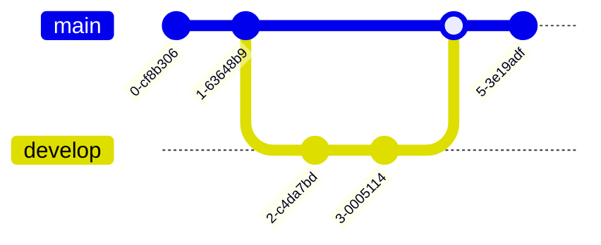

# develop branch

- 開發的基礎分支
- 下次發布的狀態


## 細部分支
- [feature branch](feature%20branch.md)：完成後 [git merge](dontTrustYourLittleBrain/git%20merge.md) 回 [develop branch](develop%20branch.md) 後刪除


## 生成
從 [master(main) branch](master(main)%20branch.md) 生成

[git checkout -b 建立並切換分支](git%20checkout%20-b%20建立並切換分支)
```shell
$ git checkout -b develop master
```

## 發布時
[master(main) branch](master(main)%20branch.md) 對 [develop branch](develop%20branch.md) 進行合併

```shell
$ git checkout master # 切換到 master 分支
$ git merge --no-ff develop # master 分支對 develop 分支進行合併
```

> `-no-ff` 參數代表不要快轉模式（fast-forward），會額外產生一個 Commit 物件。

