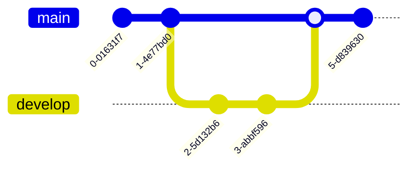

# Develop

- 開發的基礎分支
- 下次發布的狀態


## 細部分支
- [Feature Branch](Feature%20Branch.md)：完成後合併回 [Develop Branch](Develop%20Branch.md) 後刪除


## 生成
從 [Master Branch](Master%20Branch.md) 生成
```shell
$ git checkout -b develop master
```

## 發布時
[Master Branch](Master%20Branch.md) 對 [Develop Branch](Develop%20Branch.md) 進行合併

```shell
$ git checkout master # 切換到 master 分支
$ git merge --no-ff develop # master 分支對 develop 分支進行合併
```

> `-no-ff` 參數代表不要快轉模式（fast-forward），會額外產生一個 Commit 物件。

