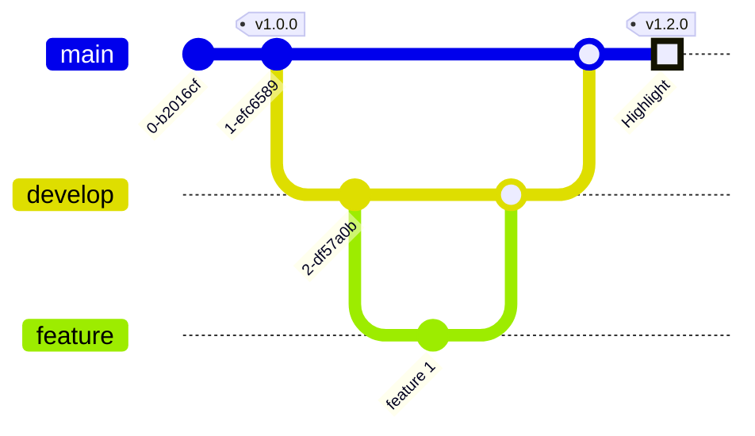

# feature branch
- 新增功能用
- 開發完成併回 [develop branch](develop%20branch.md) 後刪除

## 注意
多個 [feature branch](feature%20branch.md) 合併時容易造成 conflict，功能切得越小越好，開發越短越好

```mermaid
gitGraph
	commit
	commit tag: "v1.0.0"
	branch develop
	checkout develop
	commit
	branch feature
	checkout feature
	commit id: "feature 1"
	checkout develop
	merge feature
	checkout main
	merge develop
	commit id: "Highlight" type: HIGHLIGHT tag: "v1.2.0"
```