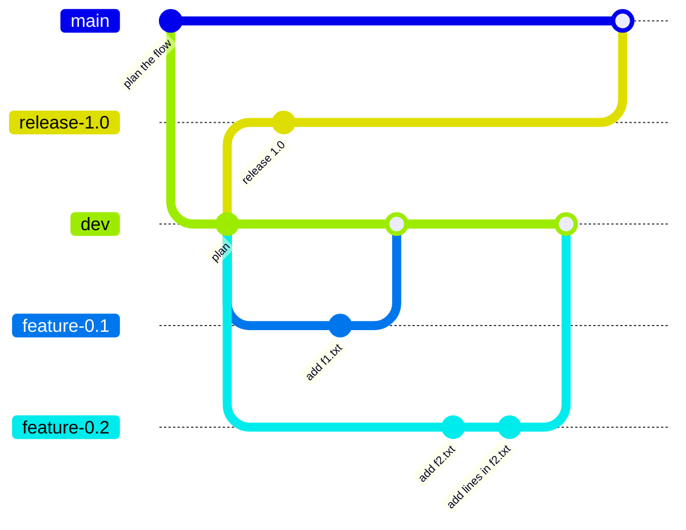

## Git flow

### 常駐分支
- [master(main) branch](master(main)%20branch.md)
- [develop branch](develop%20branch.md)

### 短期分支 
- [feature branch](feature%20branch.md)
- [hotfix branch](hotfix%20branch.md)
- [release branch](release%20branch.md)

|分支|[feature branch](feature%20branch.md)|[hotfix branch](hotfix%20branch.md)|[release branch](release%20branch.md)|
|:-:|:-:|:-:|:-:|
|[git checkout -b 建立並切換分支](dontTrustYourLittleBrain/git%20checkout%20-b%20建立並切換分支.md)|[develop branch](develop%20branch.md)|[master(main) branch](master(main)%20branch.md)|[develop branch](develop%20branch.md)|
|[git merge](dontTrustYourLittleBrain/git%20merge.md)|[develop branch](develop%20branch.md)|兩常駐分支|兩常駐分支|
|命名習慣|feature-<版號>|bugfix-<版號>|release-<版號>|

## 實作
