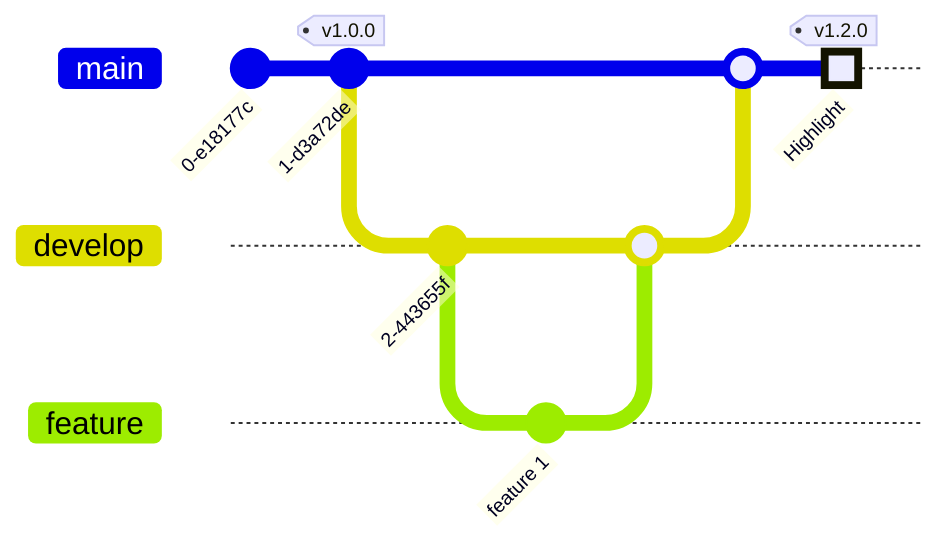

# feature branch
- 新增功能用
- 開發完成併回 [develop branch](Git%20Flow/develop%20branch.md) 後刪除

## 注意
多個 [feature branch](feature%20branch.md) 合併時容易造成 conflict，功能切得越小越好，開發越短越好




## 生命週期
### 建立
```shell
$ git checkout -b feature-x develop
```

### 完成後合併回 [develop branch](Git%20Flow/develop%20branch.md)

```shell
$ git checkout develop # 切換到 develop 分支
$ git merge --no-ff feature-x # 合併 feature-x 分支，使用非快轉模式合併
```

### 刪除
```shell
$ git branch -d feature-x # 刪除 feature-x 分支
```


