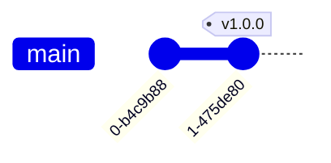

# master branch
- 第一條預設的分支
- ==上線==狀態的版本
- 給客戶看
- 開發者不要直接 [git commit](../dontTrustYourLittleBrain/不算前端也不算後端/Git/基礎/Repository/git%20commit.md) 到這
- 穩定版
- 有版本編號

```mermaid

gitGraph
	commit
	commit tag: "v1.0.0"

```
