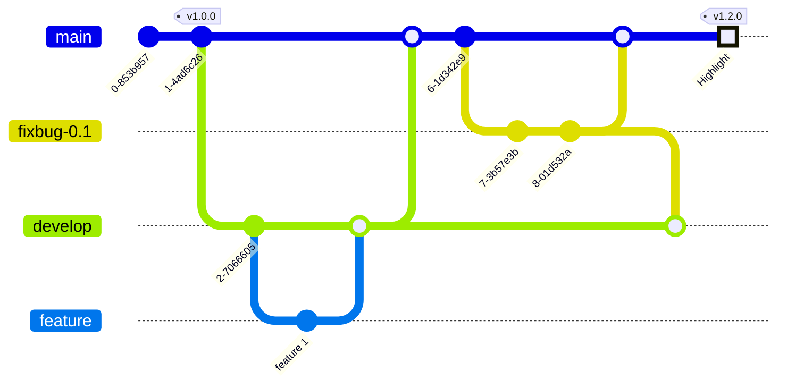

# hotfix branch
- [master(main) branch](master(main)%20branch.md) 出現 BUG 的時候的緊急修復分支
- 修復完畢後要 Merge 到 [develop branch](develop%20branch.md), [master(main) branch](master(main)%20branch.md)



## 生命週期
### 分出 hotfix 分支
```shell
$ git checkout -b fixbug-0.1 master
```

>常用 `fixbug-*` 的形式命名


### 完成後合併到 [master(main) branch](master(main)%20branch.md) 及 [develop branch](develop%20branch.md)

```shell
$ git checkout master # 切換到 master 分支
$ git merge --no-ff fixbug-0.1 # 搭配非快轉模式參數合併 hotfix 分支
$ git tag -a 0.1.1 # 貼上訊息標籤


$ git checkout develop # 切換到 develop 分支
$ git merge --no-ff fixbug-0.1 # 搭配非快轉模式參數合併 hotfix 分支
```


### 刪除分支
> `-d`：delete

```shell
$ git branch -d fixbug-0.1 # 刪除 fixbug-0.1 分支
```

