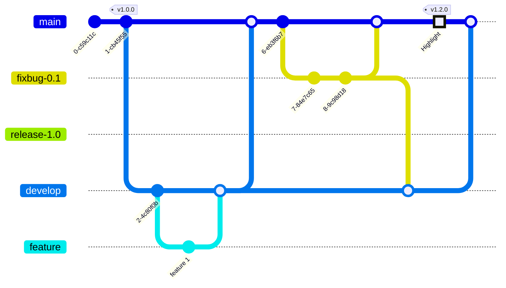

# Release Branch
- [develop branch](develop%20branch.md) 夠成熟後合併到這個分支
- 像上線前的最後測試
- 完成後合併到 [develop branch](develop%20branch.md), [master branch](master%20branch.md)

```mermaid
gitGraph
	commit
	commit tag: "v1.0.0"
	branch develop order: 1
	checkout develop
	commit
	branch feature order: 2
	checkout feature
	commit id: "feature 1"
	checkout develop
	merge feature
	checkout main
	merge develop
	commit
	branch fixbug-0.1
	checkout fixbug-0.1
	commit
	commit
	checkout main
	merge fixbug-0.1
	checkout develop
	merge fixbug-0.1
	checkout main
	commit id: "Highlight" type: HIGHLIGHT tag: "v1.2.0"
	checkout develop
	branch release-1.0
	checkout main
	merge release-1.0
```
