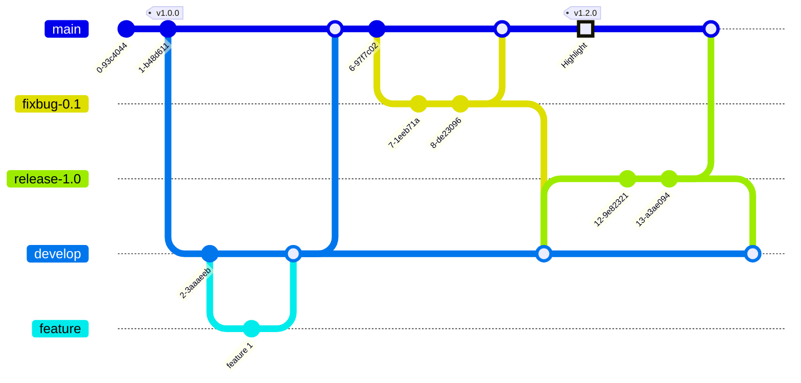

# release branch
- [develop branch](Git%20Flow/develop%20branch.md) 夠成熟後合併到這個分支
- 像上線前的最後測試
- 完成後合併到 [develop branch](Git%20Flow/develop%20branch.md), [master(main) branch](Git%20Flow/master(main)%20branch.md)



## 生命週期
>[git checkout -b 建立並切換分支](dontTrustYourLittleBrain/git%20checkout%20-b%20建立並切換分支.md)

### 從 [develop branch](Git%20Flow/develop%20branch.md) 分支出來
```shell
$ git checkout -b release-1.2 develop
```

>`release-*` 的形式命名

## 完成後合併回 [develop branch](Git%20Flow/develop%20branch.md) & [master(main) branch](Git%20Flow/master(main)%20branch.md)
```shell
$ git checkout master # 切換到 master 分支
$ git merge --no-ff release-1.2 # 合併 release-1.2 分支，使用非快轉模式合併
$ git tag -a 1.2 # 為新的節點新增訊息標籤

$ git checkout develop # 切換到 develop 分支
$ git merge --no-ff release-1.2 # 合併 release-1.2 分支，使用非快轉模式合併

$ git branch -d release-1.2
```
